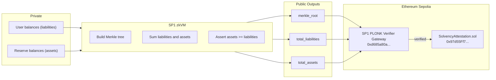
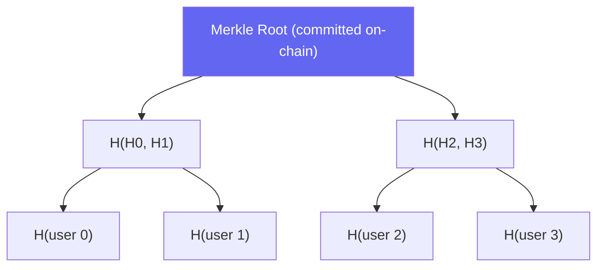
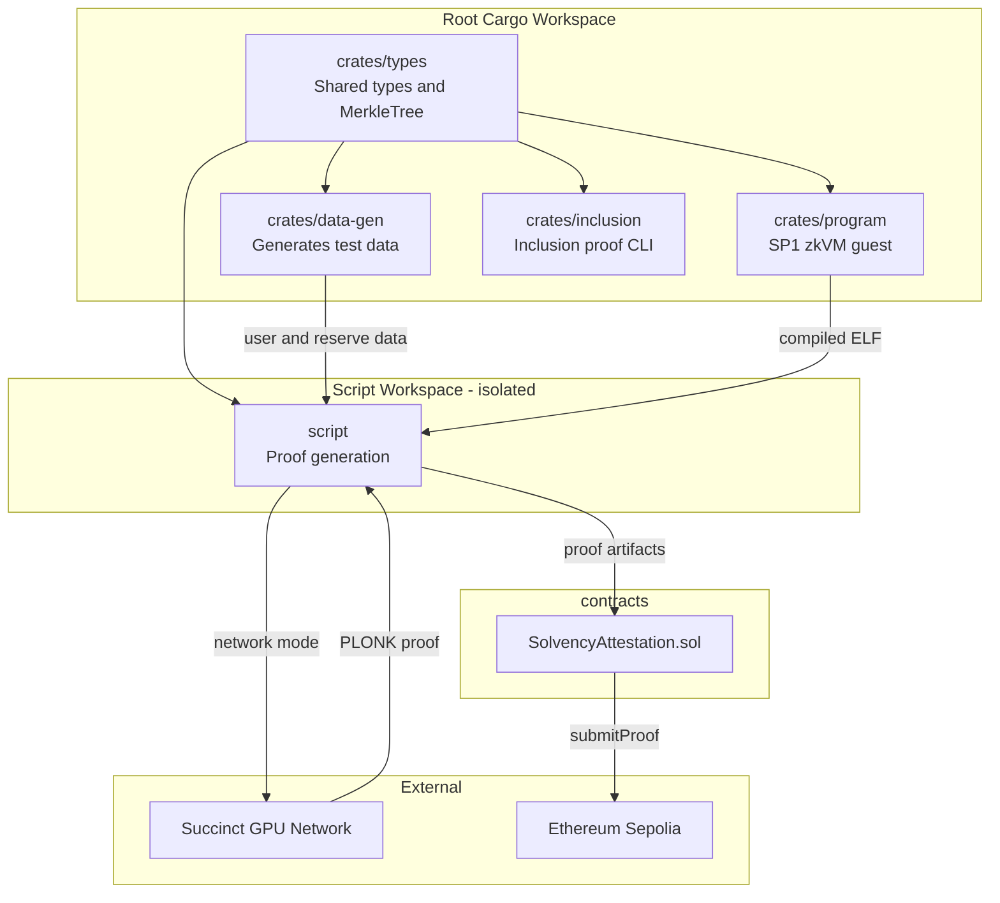
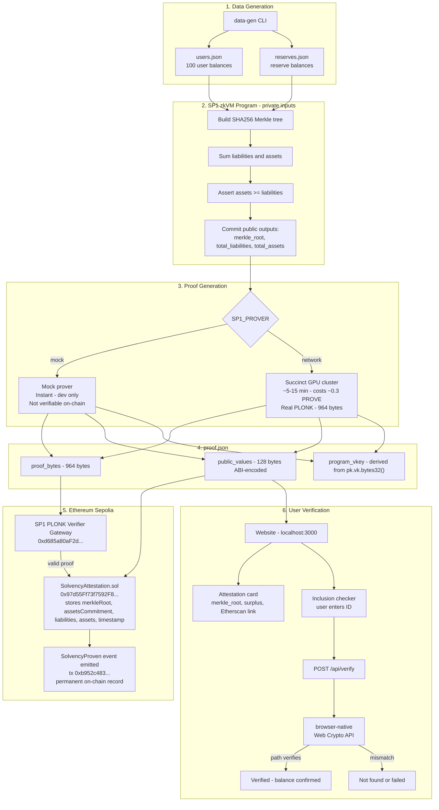

# ZK Solvency Protocol — 10-Minute Presentation

---

## Slide 1 — The Problem (1 min)

**Opening hook**: "In November 2022, FTX collapsed. It had $9B in liabilities and $900M in liquid assets. Customers had no way to know."

The trust problem: every centralized exchange asks you to trust their balance sheet. That document can be fabricated, delayed, or simply never published.

**The question**: Can an exchange *prove* solvency without revealing anything sensitive — no individual balances, no reserve addresses?

---

## Slide 2 — The Insight (30 sec)

Zero-knowledge proofs let you prove a *statement is true* without revealing the *witness* (the underlying data).

> "I know a set of numbers that sum to X, and their sum is <= Y" — provable without showing the numbers.

This project applies that idea to exchange solvency.

---

## Slide 3 — System Architecture (2 min)

Walk through left to right:
1. Exchange feeds private inputs into the SP1 zkVM
2. The program builds a Merkle tree, sums both sides, asserts solvency
3. SP1 generates a PLONK ZK proof (964 bytes, constant size)
4. The on-chain verifier checks the proof — if valid, the attestation is recorded permanently

**Key property**: the proof is *unforgeable*. You cannot produce a valid proof if assets < liabilities.

---

## Slide 4 — The Merkle Tree: Why It Matters (1 min)

The Merkle root is a fingerprint of *all* user balances. Once it is on-chain:
- The exchange cannot swap out balances retroactively
- Each user can verify their own balance is included by presenting a **sibling path** — log2(N) hashes
- No other user's balance is revealed

---

## Slide 5 — Demo (2 min)

Live walkthrough of `http://localhost:3000`:

1. **Attestation card** — merkle root, total liabilities (501,258), total assets (601,509), surplus (+100,251), live Etherscan link to the `SolvencyProven` tx
2. **Inclusion checker** — enter user ID `42` → green panel: balance, leaf hash, proof depth, merkle root matches attestation card
3. **Inclusion checker** — enter `9999` → red panel: not found

Point out: the sibling path is verified in the browser using the Web Crypto API — no server trust required after the proof material is returned.

**On-chain proof**: https://sepolia.etherscan.io/tx/0xb952c483e839b5cfbe3694ac4e3a3ace9a643d2dea2273d867dd5c5ea8f43ea3

---

## Slide 6 — Benchmarks (1 min)

| Operation | Complexity | N=10 | N=5000 |
|---|---|---|---|
| Merkle build | O(N) | 0.016 ms | 3.1 ms |
| Inclusion prove | O(log N) | ~0.14 µs | ~0.14 µs |
| Inclusion verify | O(log N) | ~3 µs | ~3 µs |
| SP1 mock execution | ~O(N) | 0.07 s | 27 s |
| On-chain gas | constant | ~97k (mock) | ~250k (PLONK) |

Key insight: **prove/verify are essentially constant** — users do not pay a scaling cost. The exchange bears the O(N) proof generation cost, not users.

---

## Slide 7 — What Gives Users Confidence (30 sec)

Three independent guarantees:

1. **Solvency** — ZK proof is mathematically unforgeable; a dishonest exchange cannot produce a valid proof
2. **Inclusion** — Merkle root is tamper-evident; user verifies their own balance without trusting anyone
3. **Permanence** — On-chain attestation is immutable; anyone can re-verify with just the transaction hash

---

## Slide 8 — Professor Feedback and What Was Added (30 sec)

Original scope: prove solvency, verify on-chain. Professor asked: *what about the user experience?*

Added:
- **Benchmarking** — how does inclusion proof generation scale with N? Answer: O(log N) per user — essentially constant
- **Website** — any user can check their own inclusion without running Rust code

---

## Slide 9 — Wrap-Up (30 sec)

**What was built**: end-to-end ZK solvency system — data generation → zkVM proof → on-chain attestation → user inclusion verification → web UI

**Deployed on Sepolia**:
- Contract: `0x97d55Ff73f7592F85AafF025a94963d02266cC78`
- Real PLONK proof verified on-chain — tx `0xb952c483…`
- Full pipeline: mock dev mode → network proof → deploy → submit → web UI with live Etherscan link

**What is left for production**:
- Periodic attestation cadence (daily/weekly automation)
- ECDSA signature over the Merkle root to bind prover identity
- User authentication for the inclusion checker (currently open by ID)

---

## Timing Summary

| Section | Time |
|---|---|
| Problem + Insight | 1.5 min |
| Architecture diagram | 2 min |
| Merkle tree explanation | 1 min |
| Demo | 2 min |
| Benchmarks | 1 min |
| User confidence + feedback | 1 min |
| Wrap-up | 30 sec |
| **Total** | ~9 min |

The demo is the strongest segment — let it breathe. With `deployment.json` present, the attestation card shows the live Etherscan link immediately.

---

## Repository Architecture

**Key structural decisions visible here:**

- `crates/types` is the single shared library — all four crates depend on it, no duplication of `UserBalance`, `MerkleTree`, etc.
- `script/` is an isolated workspace (separate from root) to avoid a `serde_core` conflict between sp1-sdk and alloy. It re-imports `crates/types` via path dependency.
- `web/` bridges the Rust and TypeScript worlds at runtime via the `/api/verify` route, which runs Merkle proof generation server-side in Rust-derived TypeScript logic — no subprocess.
- `proof.json` is the central artifact connecting the Rust proof pipeline to both the Solidity contract and the web frontend. `program_vkey` in `proof.json` is derived live from `pk.vk.bytes32()` — never hardcoded.

---

## Complete Workflow

